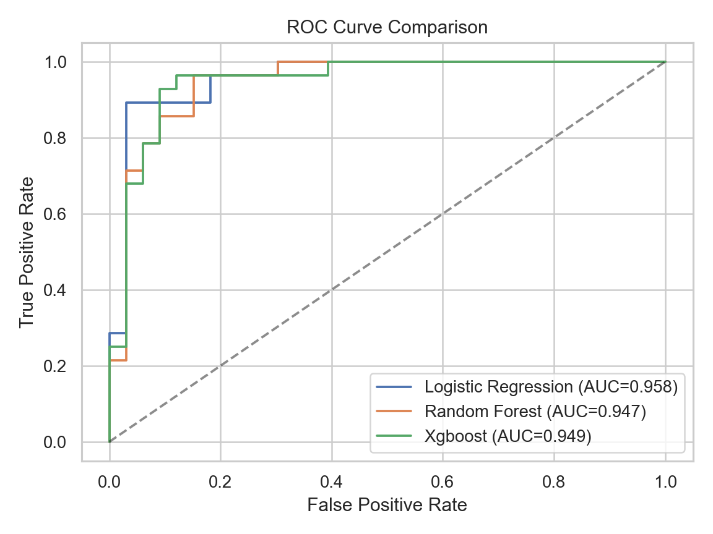
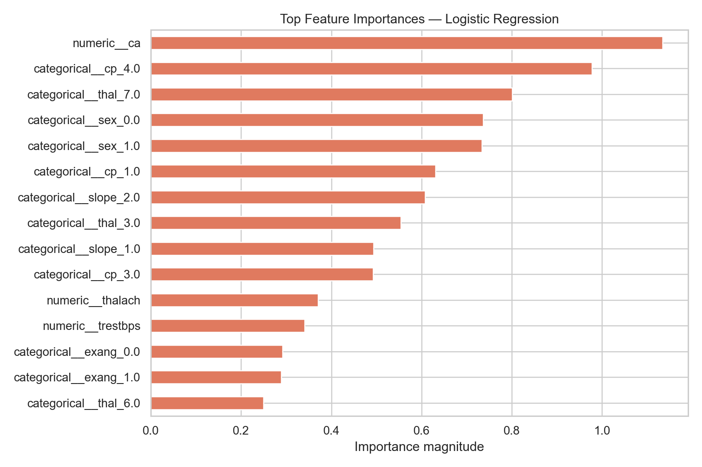
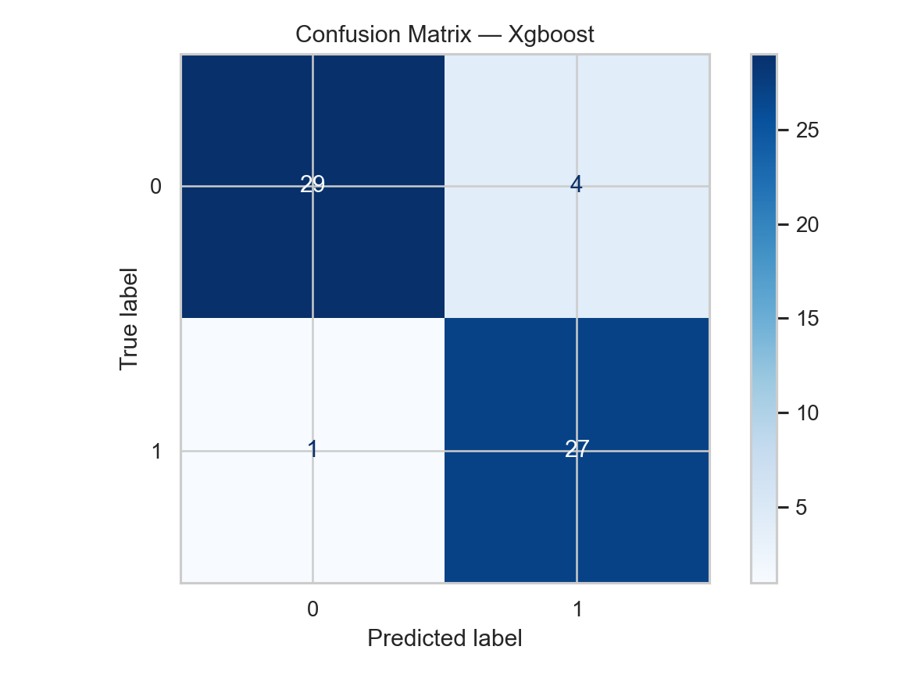
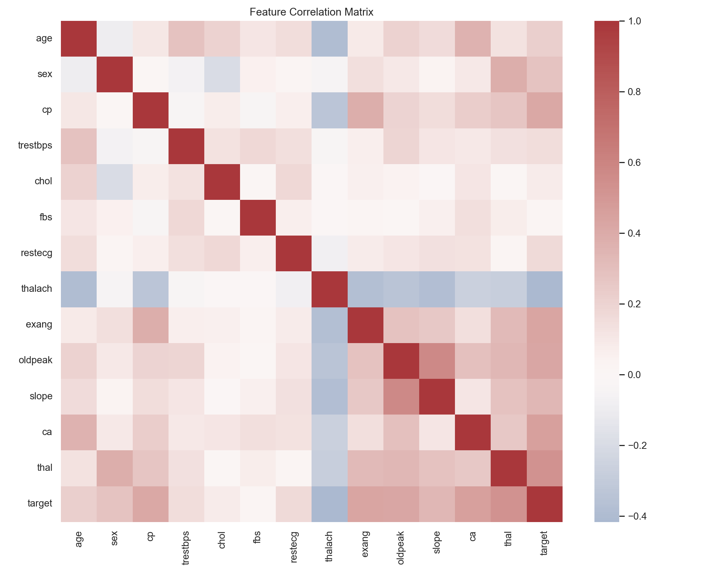

# Machine Learning Prediction System

## Overview

This independent machine learning research project explores interpretable
predictive modeling using structured health data. It demonstrates a complete
workflow for data preprocessing, model development, evaluation, and scientific
visualization. This is an educational research artifact, not a clinical tool.

## Academic Background

This project extends my undergraduate training in Data Science and Big Data
Technology at Hubei University of Economics. My undergraduate thesis received
an Excellent Undergraduate Thesis recognition, motivating further exploration of
data-driven research methods.

## Research Question

Can machine learning models accurately predict the presence of heart disease
from structured clinical measurements after appropriate preprocessing,
feature engineering, and model evaluation?

## Dataset

The project uses the processed Cleveland subset (303 observations, 13 input
features) of the [UCI Heart Disease dataset](https://doi.org/10.24432/C52P4X).
The original diagnosis `num` is converted to a binary target: `0` indicates
absence and values `1–4` indicate presence of heart disease. The data contains
a small number of missing values in `ca` and `thal`; these are imputed inside
the training pipeline to avoid leakage. The dataset is CC BY 4.0.

## Methodology

The workflow uses a reproducible stratified 80/20 holdout split
(`random_state=42`). Numeric fields receive median imputation and standardization;
categorical fields receive most-frequent imputation and one-hot encoding. All
transformations are fitted on training data only through scikit-learn pipelines.

Three classifiers are compared:

1. Logistic Regression — transparent linear baseline
2. Random Forest — nonlinear bagged-tree model
3. XGBoost — gradient-boosted tree model

Accuracy, precision, recall, F1-score, and ROC-AUC are measured on the untouched
test set. Confusion matrices, ROC curves, and model-derived feature importance
support interpretation.

## Experimental Results

The following results were generated on the stratified 20% holdout set
(61 observations) using the reproducible pipeline described above.

| Model | Accuracy | Precision | Recall | F1-score | ROC-AUC |
|---|---:|---:|---:|---:|---:|
| Logistic Regression | 0.8689 | 0.8125 | 0.9286 | 0.8667 | 0.9578 |
| Random Forest | 0.9016 | 0.8438 | 0.9643 | 0.9000 | 0.9470 |
| XGBoost | 0.9180 | 0.8710 | 0.9643 | 0.9153 | 0.9491 |

XGBoost achieved the highest holdout accuracy and F1-score, while Logistic
Regression achieved the highest ROC-AUC. Given the small dataset and single
holdout split, these results should be interpreted as a reproducible model
comparison rather than an estimate of clinical performance.

## Visualization

### ROC curve comparison



### Feature importance



### XGBoost confusion matrix



### Feature correlation heatmap



Additional class-distribution, feature-distribution, and model-specific
confusion-matrix figures are retained in `results/figures/`.

## Reproduce

```bash
python -m venv .venv
# Windows: .venv\Scripts\activate
# macOS/Linux: source .venv/bin/activate
python -m pip install -r requirements.txt
python src/preprocess.py
python src/train.py
python src/evaluate.py
jupyter notebook notebooks/exploratory_analysis.ipynb
```

Python 3.10 or newer is recommended. The first command that loads data downloads
the official CSV from UCI. A fixed seed makes the split and estimators
repeatable, subject to platform/library numerical differences.

## Repository Structure

```text
data/                 dataset notes and downloaded CSV
models/               serialized fitted pipelines (git-ignored)
notebooks/            guided exploratory analysis
results/figures/      generated scientific figures
src/preprocess.py     data acquisition, validation, and splitting
src/train.py          preprocessing and model training
src/evaluate.py       metrics, EDA, and model interpretation
```

## Technologies

Python, Pandas, NumPy, Scikit-learn, XGBoost, Matplotlib, Seaborn, Jupyter, Git

## Limitations

The sample is small and historical, the holdout estimate has substantial
uncertainty, and the target is simplified to a binary outcome. Correlation and
model importance do not establish causality. Results should not be interpreted
as medical advice or as evidence of clinical deployment readiness.

## Future Work

- evaluate larger, more diverse datasets with repeated cross-validation
- quantify uncertainty and subgroup performance
- compare calibrated probabilities and decision thresholds
- add SHAP-based explainable AI analysis
- investigate deep learning only when dataset scale supports it

## Author

**Hongli Qiu**<br>
B.S. in Data Science and Big Data Technology<br>
Hubei University of Economics<br>
[GitHub](https://github.com/qiu11111111)
